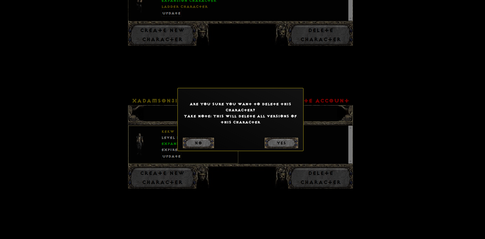

<h1>DoNotExpire's user interface</h1>
<h2>Home</h2>

<h2>Updating character</h2>

<h2>Deleting character</h2>

<h2>Character's equipment</h2>

<h2>Choose your hero class</h2>

<h2>Click on a class and fill in details</h2>

